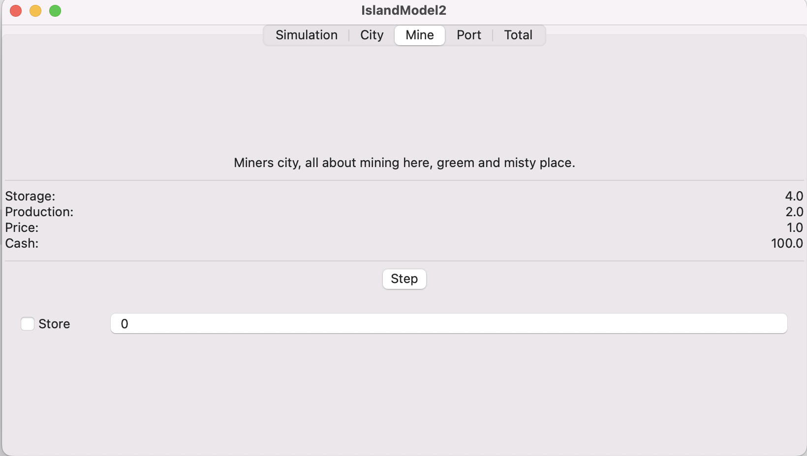
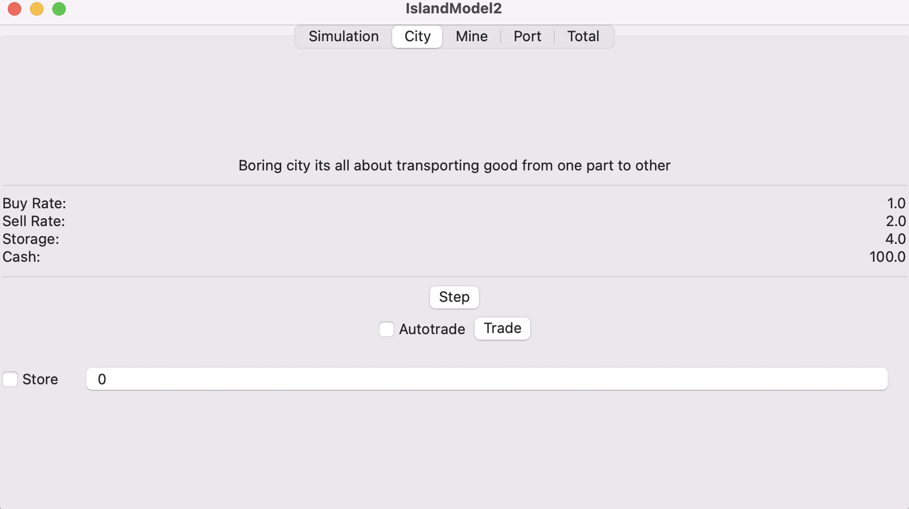
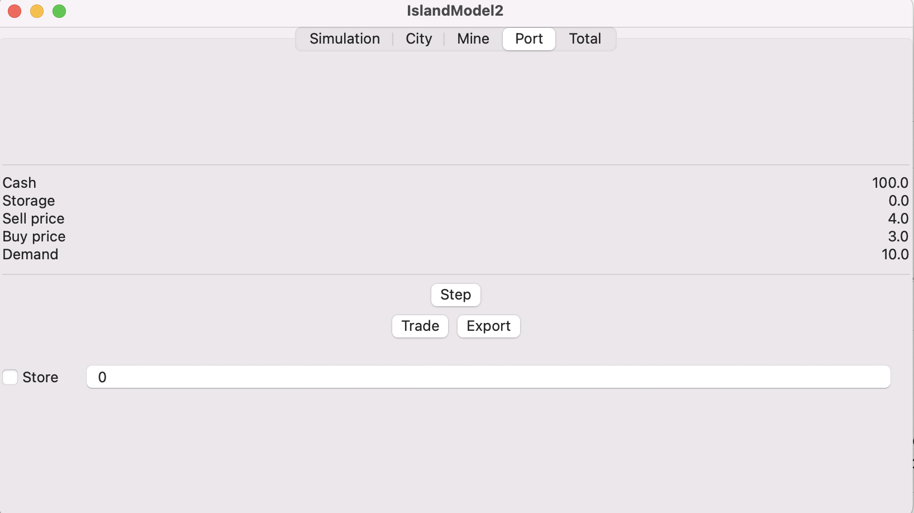

#  IslandModel2

## Intro

Economy simulator. Goal to learn SwiftUI.

## Learning

    Observables and State
    Modifiers

## Further to learn
    Custom SwiftUI elements
    Make style and design nice
    Save state of SwiftUI
    Load/Store to config file
    Drawing graphsi with CoreGraphics
    Multithreading
    Local networking
    Core data

## Describe economic model

### Mine

Mining city get resources and sells them to city.

### City

Transportation hub between Mine and Port.

### Port

Export hub to outerland, the way how cash flow in.

### Outerland

Outerland land that creates demand for resources.
